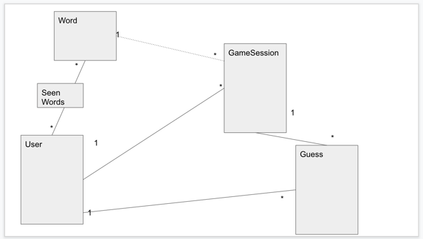

# README

This is a pet project: a very "light" version of the woordle game.\
Purpose of the game is to guess a secret word (5 letters word) in 5 tries max.\
Player will enter a 5 letter word and as a response will get 
an array with indication on each given letter:\
0 - means this letter does not exist in the secret word\
1 - means this letter exists in the secret word but it isn't in the right spot\
2 - means this letter exists in the secret word and it is in the right spot\

For example: 
secret word is MAPLE

* First try: TABLE will result [0,2,0,2,2]
* Second try: PADLE will result [1,2,0,2,2]
* Third try: MAPLE will result [2,2,2,2,2] => end of game session

If player will guess the word on 1st try he will get 100 point\
2nd try => 80 point\
3rd try => 60 point\
4th try => 40 point\
5th try => 20 point\
No guess => 0 points

* Ruby version: 3.1.1p18
* Rails       : 7.0.2.3

* Model:
